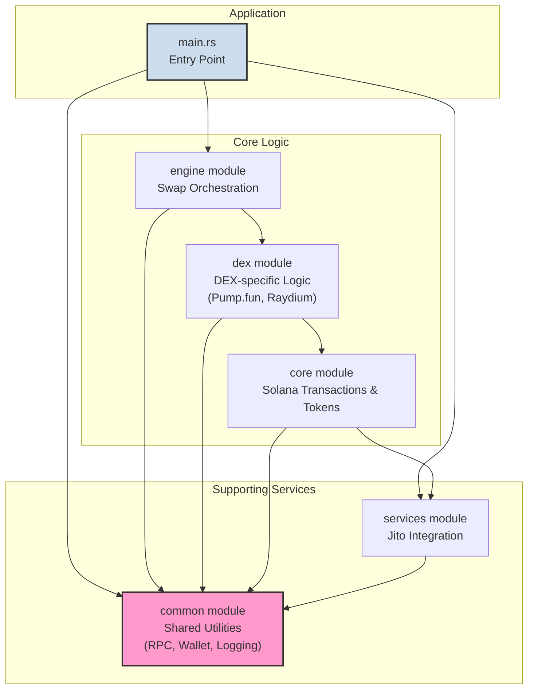
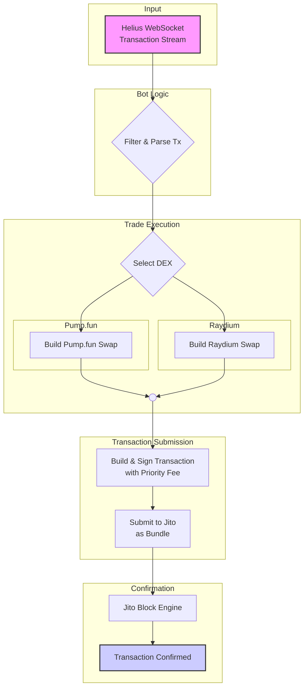

# 🚀 **Solana Copy Trading Bot (Rust)**

Welcome to the **Solana Copy Trading Bot**! This bot enables real-time tracking of target wallets (whales) on the Solana blockchain and seamlessly replicates their trades. 🌟

---

## 🔥 **Features**

✅ **Real-time WebSocket Streaming** – Connects to Solana's blockchain using Helius Geyser RPC WebSocket to monitor transactions in real-time.  
✅ **Ultra-Fast Transaction Filtering** – Efficiently filters transactions within ~0.3ms for minimal latency.  
✅ **Automated Copy Trading** – Uses the Pump.fun program ID and Raydium module to mirror target transactions.  

---

## 🏛️ **Project Architecture**

This project is organized into several distinct modules, each responsible for a specific part of the copy trading process. This modular design enhances code readability, maintainability, and scalability.

- **`main.rs`**: The entry point of the application. It initializes the environment, connects to the Helius WebSocket, and orchestrates the overall workflow.
- **`common`**: Contains shared utilities for RPC client creation, wallet management, and logging.
- **`core`**: Manages core Solana functionalities, including SPL token interactions and transaction handling.
- **`dex`**: Implements the logic for interacting with decentralized exchanges (DEXs) like Pump.fun and Raydium.
- **`engine`**: A high-level module that simplifies swap operations by abstracting away DEX-specific details.
- **`services`**: Provides an interface to external services, such as the Jito Block Engine, for enhanced transaction processing.



---

## 🔄 **Workflow Diagram**

The following diagram illustrates the end-to-end workflow of the Solana Copy Trading Bot, from real-time transaction monitoring to trade execution:



---

## 🎯 **Example Transactions**

- **Source Transaction:** [View on Solscan](https://solscan.io/tx/2nNc1DsGxGoYWdweZhKQqnngfEjJqDA4zxnHar2S9bsAYP2csbLRgMpUmy68xuG1RaUGV9xb9k7dGdXcjgcmtJUh)
- **Copied Transaction:** [View on Solscan](https://solscan.io/tx/n2qrk4Xg3gfBBci6CXGKFqcTC8695sgNyzvacPHVaNkiwjWecwvY5WdNKgtgJhoLJfug6QkXQuaZeB5hVazW6ev)
- **Target Wallet:** `GXAtmWucJEQxuL8PtpP13atoFi78eM6c9Cuw9fK9W4na`
- **Copy Wallet:** `HqbQwVM2fhdYJXqFhBE68zX6mLqCWqEqdgrtf2ePmjRz`

---

## 🚀 **Getting Started**

Follow these steps to set up and run the bot:

### 📌 Prerequisites

- **Rust & Cargo** (Version 1.84.0 or later)
- **Solana Wallet** with access to **Helius Geyser RPC API**

### 📥 Installation

1️⃣ **Clone the Repository:**

```bash
git https://github.com/koheiDev316/Solana-Copy-Trading-Bot-On-DEX-Pumpfun-and-Raydium
```

2️⃣ **Navigate & Build:**

```bash
cd copy-trading-bot
cargo build
```

3️⃣ **Configure Environment Variables:**

Update the `ENDPOINT` and `WSS_ENDPOINT` in your config:

```ts
const ENDPOINT = "https://mainnet.helius-rpc.com/?api-key=xxx";
const WSS_ENDPOINT = "wss://atlas-mainnet.helius-rpc.com/?api-key=xxx";
```

4️⃣ **Run the Bot:**

```bash
cargo run
```

---


🌹 **You're always welcome!** 🌹

